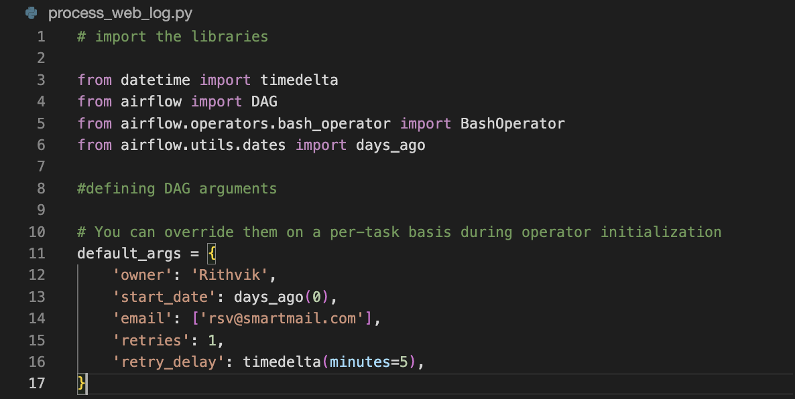
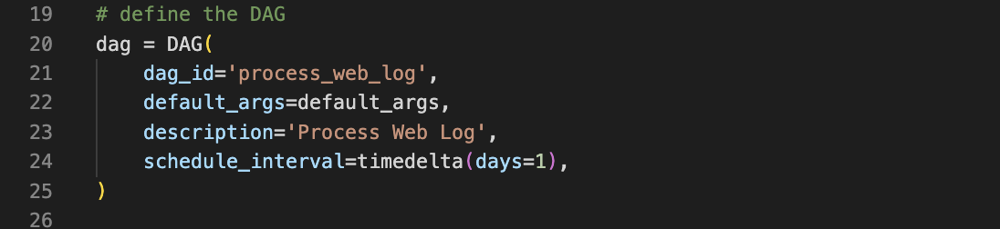
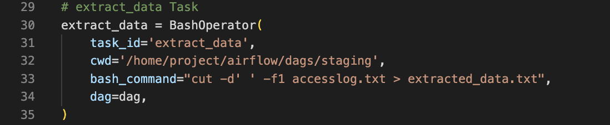
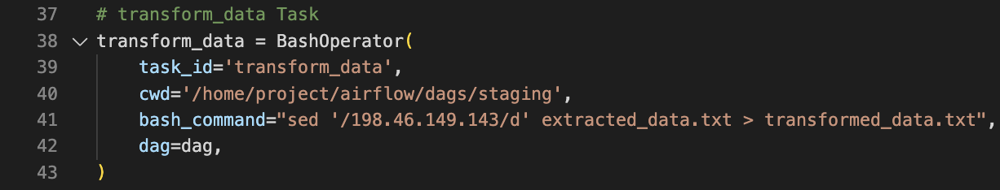
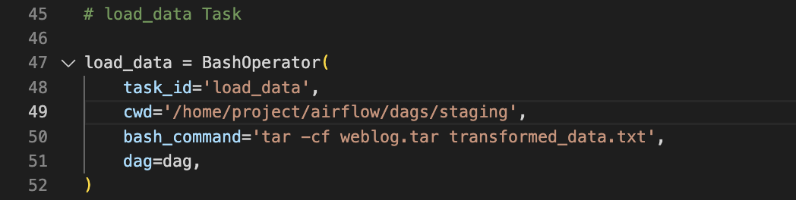
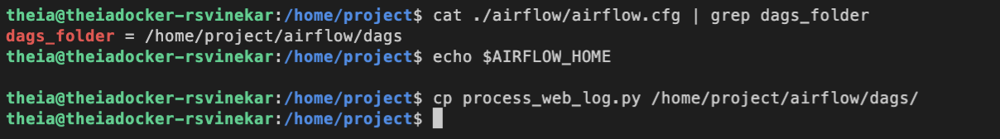
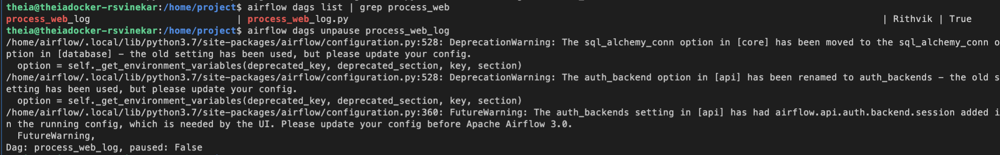
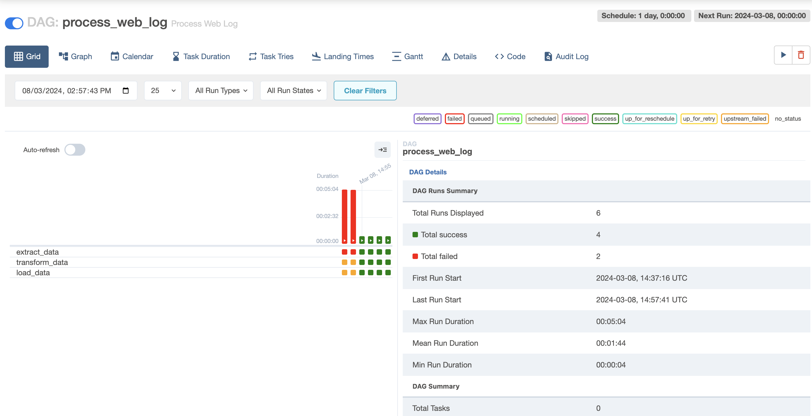

# Airflow

---
# Scenario
Write a pipeline that analyzes the web server log file, extracts the required lines(ending with html) and fields(time stamp, size ) and transforms (bytes to mb) and load (append to an existing file.)

# Objectives
In this assignment you will author an Apache Airflow DAG that will:

- Extract data from a web server log file
- Transform the data
- Load the transformed data into a tar file

## Tools / Software
- Apache AirFlow

# Exercise 1 - Prepare the lab environment
Before you start the assignment:

Start Apache Airflow.
Download the dataset from the source to the destination mentioned below.
Source : [accesslog.txt](accesslog.txt)

Destination : /home/project/airflow/dags/capstone

# Exercise 2 - Create a DAG

## Task 1 - Define the DAG arguments
Create a DAG with these arguments.

- owner
- start_date
- email

You may define any suitable additional arguments.

Take a screenshot of the code you used clearly showing the above arguments.

Name the screenshot dag_args.jpg. (Images can be saved with either the .jpg or .png extension.)

## Task 2 - Define the DAG
Create a DAG named process_web_log that runs daily.

Use suitable description.

Take a screenshot of the code you used to define the DAG.

Name the screenshot dag_definition.jpg. (Images can be saved with either the .jpg or .png extension.)

## Task 3 - Create a task to extract data
Create a task named extract_data.

This task should extract the ipaddress field from the web server log file and save it into a file named extracted_data.txt

Take a screenshot of the task code.

Name the screenshot extract_data.jpg. (Images can be saved with either the .jpg or .png extension.)

## Task 4 - Create a task to transform the data in the txt file
Create a task named transform_data.

This task should filter out all the occurrences of ipaddress “198.46.149.143” from extracted_data.txt and save the output to a file named transformed_data.txt.

Take a screenshot of the task code.

Name the screenshot transform_data.jpg. (Images can be saved with either the .jpg or .png extension.)

## Task 5 - Create a task to load the data
Create a task named load_data.

This task should archive the file transformed_data.txt into a tar file named weblog.tar.

Take a screenshot of the task code.

Name the screenshot load_data.jpg. (Images can be saved with either the .jpg or .png extension.)

## Task 6 - Define the task pipeline
Define the task pipeline as per the details given below:

### Task	Functionality
First task	extract_data
Second task	transform_data
Third task	load_data
---
Take a screenshot of the task pipeline section of the DAG.

Name the screenshot pipeline.jpg. (Images can be saved with either the .jpg or .png extension.)

# Exercise 3 - Getting the DAG operational.
Save the DAG you defined into a file named process_web_log.py.

## Task 7 - Submit the DAG
Take a screenshot of the command you used and the output.

Name the screenshot submit_dag.jpg. (Images can be saved with either the .jpg or .png extension.)

## Task 8 - Unpause the DAG
Take a screenshot of the command you used and the output.

Name the screenshot unpause_dag.jpg. (Images can be saved with either the .jpg or .png extension.)

Task 9 - Monitor the DAG
Take a screenshot of the DAG runs for the Airflow console.

Name the screenshot dag_runs.jpg. (Images can be saved with either the .jpg or .png extension.)

---
|  PREV : [Data Pipelines - Python ETL](ETL.md)  | UP:  [Project Main](Project.md) | NEXT : [Business Intelligence Dashboard - IBM Cognos Analytics](Cognos.md)
|---|---|---|

