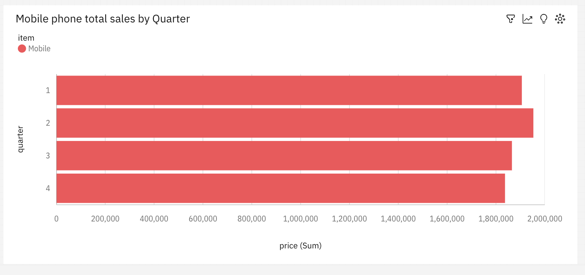

# IBM Cognos Business Analytics
---

# Scenario
You are a data engineer at an e-commerce company. Your company has finished setting up a data warehouse. Now you are assigned the responsibility to design a reporting dashboard that reflects the key metrics of the business.

# Objectives
In this assignment you will:

## Create a dashboard using Cognos Analytics
## Software Required
- IBM Cognos Analytics or Cognos Dashboard Embedded and Watson Studio
- (Optional) Cloud instance of IBM DB2 database
Note: In case you did not create an IBM Cloud account or a DB2 instance in the previous module, you can simply upload the CSV file instead into IBM Cognos Analytics.

Download the data from this link

# Exercise 1 - Load data into the data warehouse
In order to complete Tasks 1-3 below, you have an option to first load the data into a DB2 database (Option A), or load the CSV file directly into Cognos (Option B).

## Task 1 - Import data
Option A: If you choose DB2 to complete the task:
Import data in the downloaded file ecommerce.csv into a table named sales_history
Take a screenshot of the command you used to load the data into the data warehouse (DB2) and its output.

Option B: If you choose to load the data directly into Cognos:
Upload the downloaded csv file ecommerce.csv into Cognos Analytics and take a screenshot of successful loading of the CSV file into Cognos.

Name the screenshot as dataimport.jpg. (images can be saved with either .jpg or .png extension)

Task 2 - List top 10 rows
Option A: If you choose DB2 to complete the task:
List the first 10 rows in the table sales_history.

Take a screenshot of the first 10 rows of the table.

Option B: If you choose Cognos Analytics to complete the task:
Convert the uploaded dataset ecommerce.csv into a Data module and take a screenshot of the first 10 rows of the table.

Name the screenshot as top10rows.jpg. (images can be saved with either .jpg or .png extension)

# Exercise 2 - Accessing the DataSource in Cognos
## Task 3 - Create a data source in Cognos
Option A: If you choose DB2 to complete the task:
Create a data source in Cognos that points to the table sales_history in your IBM DB2 database.

Take a screenshot of the command you used and the output.

Option B: If you choose Cognos Analytics to complete the task:
Take a screenshot of the datasource in the Cognos Analytics workspace.

Name the screenshot as datasource.jpg. (images can be saved with either .jpg or .png extension)

# Exercise 3 - Create a dashboard
## Task 4 - Create a line chart
Create a line chart of month wise total sales for the year 2020.

Take a screenshot of the line chart you created.

Name the screenshot as linechart.jpg. (images can be saved with either .jpg or .png extension)

Task 5 - Create a pie chart
Create a pie chart of category wise total sales.

Take a screenshot of the pie chart you created.

Name the screenshot as piechart.jpg. (images can be saved with either .jpg or .png extension)

Task 6 - Create a bar chart
Create a bar chart of Quarterly sales of mobile phones

Take a screenshot of the bar chart you created.

Name the screenshot as barchart.jpg. (images can be saved with either .jpg or .png extension)

|  PREV : [Data Pipelines - Apache Airflow](Airflow.md) | NEXT : [Big data analytics platform – Spark](Spark.md)
|---|---|
