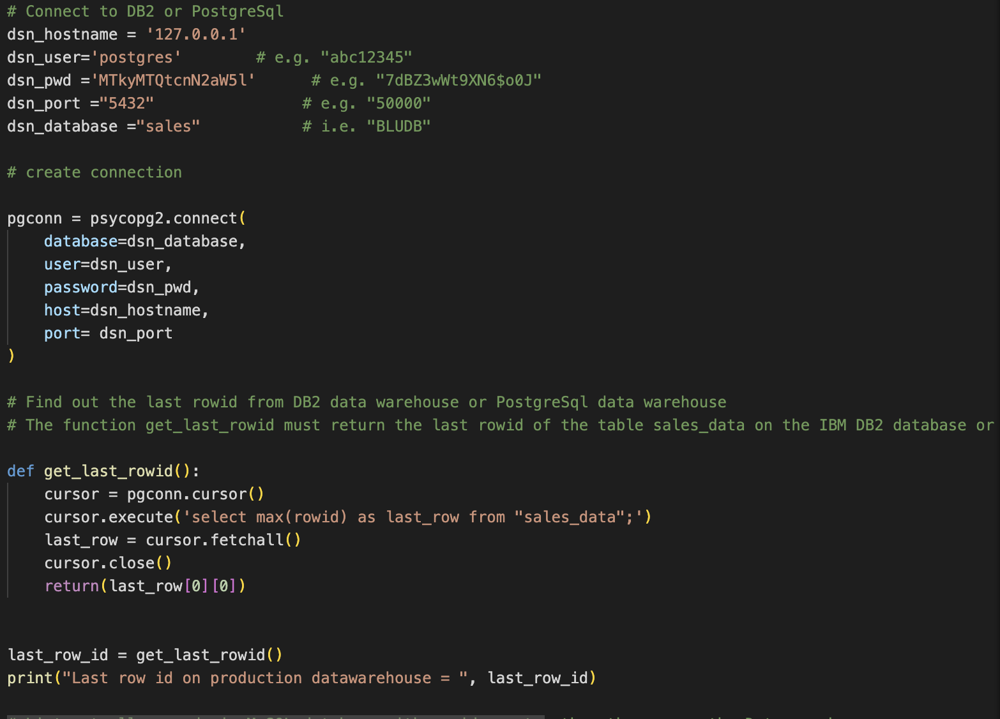
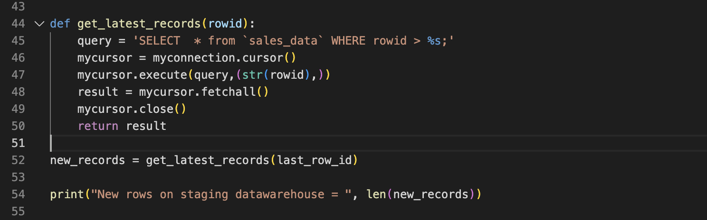
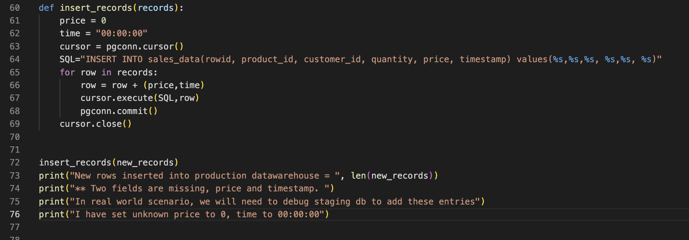
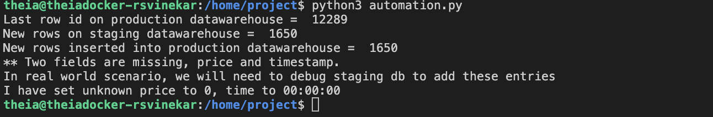

# ETL with Python and Database connectors
---

# Scenario
You are a data engineer at an e-commerce company. You need to keep data synchronized between different databases/data warehouses as a part of your daily routine. One task that is routinely performed is the sync up of staging data warehouse and production data warehouse. Automating this sync up will save you a lot of time and standardize your process. You will be given a set of python scripts to start with. You will use/modify them to perform the incremental data load from MySQL server which acts as a staging warehouse to the IBM DB2 or PostgreSQL which is a production data warehouse. This script will be scheduled by the data engineers to sync up the data between the staging and production data warehouse.

# Exercise 1 - Automate loading of incremental data into the data warehouse
One of the routine tasks that is carried out around a data warehouse is the extraction of daily new data from the operational database and loading it into the data warehouse. In this exercise you will automate the extraction of incremental data, and loading it into the data warehouse.

In order to complete Tasks 1 and 3 below, you have an option to complete the tasks on a DB2 database (Option A), or on PostgreSQL (Option B).

## Task 1 - Implement the function get_last_rowid()
In the program automation.py implement the function get_last_rowid()

Option A: If you choose DB2 as the data warehouse:
This function must connect to the DB2 data warehouse and return the last rowid.

Option B: If you choose PostgreSQL as the data warehouse:
This function must connect to the PostgreSql as the data warehouse and return the last rowid.

Take a screenshot of the python code clearly showing the implementation of the function get_last_rowid().

Name the screenshot get_last_rowid.jpg. (Images can be saved with either the .jpg or .png extension.)

## Task 2 - Implement the function get_latest_records()
In the program automation.py implement the function get_latest_records()

This function must connect to the MySQL database and return all records later than the given last_rowid.

Take a screenshot of the python code clearly showing the implementation of the function get_latest_records().

Name the screenshot get_latest_records.jpg. (Images can be saved with either the .jpg or .png extension.)

## Task 3 - Implement the function insert_records()
In the program automation.py implement the function insert_records()

Option A: If you choose DB2 as the data warehouse:
This function must connect to the DB2 data warehouse and insert all the given records.

Option B: If you choose PostgreSQL as the data warehouse:
This function must connect to the PostgreSQL data warehouse and insert all the given records.
Take a screenshot of the python code clearly showing the implementation of the function insert_records().

Name the screenshot insert_records.jpg. (Images can be saved with either the .jpg or .png extension.)

## Task 4 - Test the data synchronization
Run the program automation.py and test if the synchronization is happening as expected.

Take a screenshot of the program output .

Name the screenshot synchronization.jpg. (Images can be saved with either the .jpg or .png extension.)

---
|  PREV : [Production Data warehouse – PostgresSQL or IBM DB2 on cloud](Production.md)  | UP:  [Project Main](Project.md) | NEXT : [Data Pipelines - Apache Airflow](Airflow.md)
|---|---|---|

