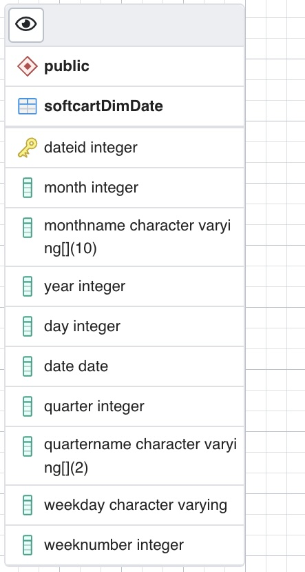
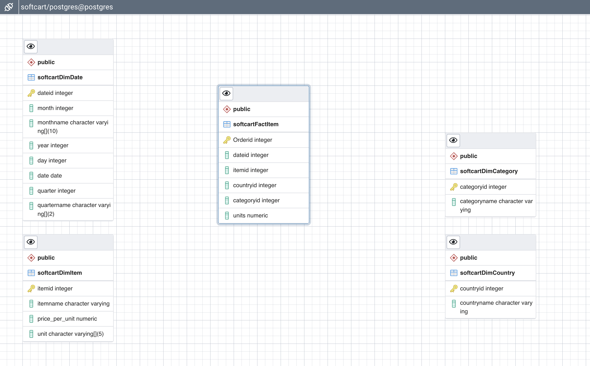
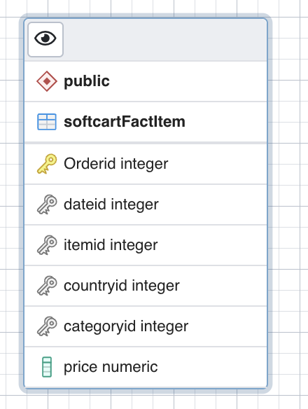
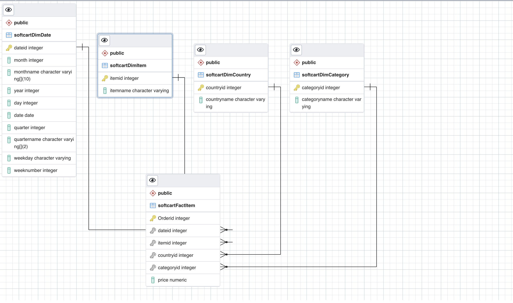
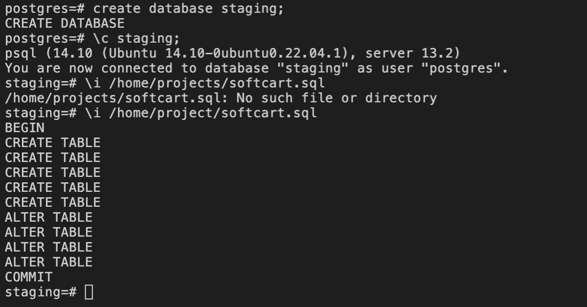

# Data Warehouse with PostgreSQL Hub and Spoke

---

# Statement
You are a data engineer hired by an ecommerce company named SoftCart.com . The company retails download only items like E-Books, Movies, Songs etc. The company has international presence and customers from all over the world. The company would like to create a data warehouse so that it can create reports like

- total sales per year per country
- total sales per month per category
- total sales per quarter per country
- total sales per category per country
You will use your data warehousing skills to design and implement a data warehouse for the company.

# Objectives
In this assignment you will:

- Design a Data Warehouse using the pgAdmin ERD design tool.
- Create the schema in the Data Warehouse

## Tools / Software
- ERD Design Tool of pgAdmin
- PostgreSQL Database Server

About the dataset
The dataset you would be using in this assignment is not a real life dataset. It was programmatically created for this assignment purpose.

Exercise 1 - Design a Data Warehouse
The ecommerce company has provided you the sample data.

You will start your project by designing a Star Schema for the warehouse by identifying the columns for the various dimension and fact tables in the schema. Name your database as softcart

## Task 1 - Design the dimension table softcartDimDate
Using the ERD design tool design the table softcartDimDate. The company is looking at a granularity of a day. Which means they would like to have the ability to generate the report on yearly, monthly, daily, and weekday basis.

Here is a partial list of fields to serve as an example:

dateid

month

monthname

…

…

## Task 2 - Design the dimension table softcartDimCategory
Using the ERD design tool design the table softcartDimCategory.

## Task 3 - Design the dimension table softcartDimItem
Using the ERD design tool design the table softcartDimItem.

## Task 4 - Design the dimension table softcartDimCountry
Using the ERD design tool design the table softcartDimCountry.

## Task 5 - Design the fact table softcartFactSales
Using the ERD design tool design the table softcartFactSales.

Take a screenshot of the table softcartFactSales in the ERD tool clearly showing all the fieldnames and data types.

## Task 6 - Design the relationships
Using the ERD design tool design the required relationships(one-to-one, one-to-many etc) amongst the tables.

# Exercise 2 - Create the schema
In this exercise you will create the schema of the data warehouse.

## Task 7 - Create the schema.
Download the schema sql from ERD tool and create the schema in a database named staging.

Take a screenshot showing the success of the schema creation.

---
|  PREV : [NoSql database - MongoDB](NoSQL.md) | UP:  [Project Main](Project.md) | NEXT : [Production Data warehouse – PostgresSQL or IBM DB2 on cloud](Production.md)
|---|---|---|
