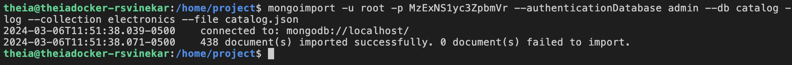
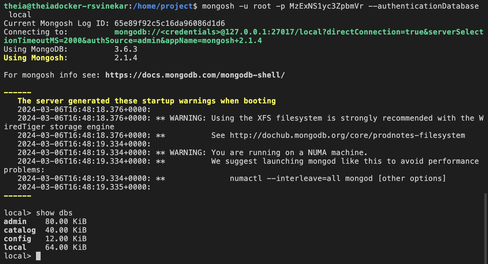
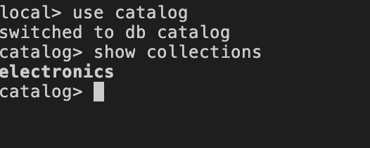
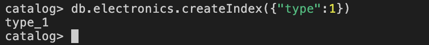
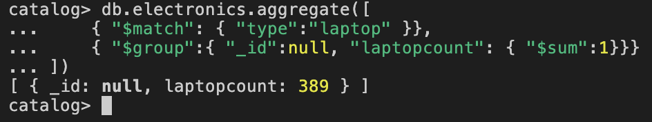
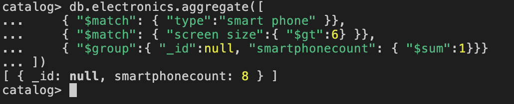
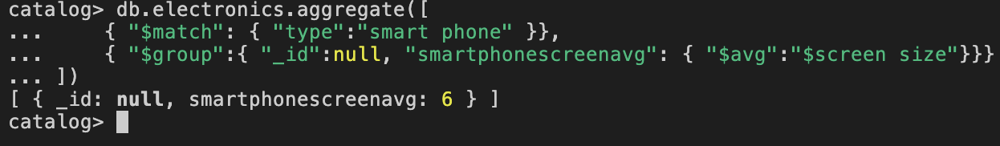
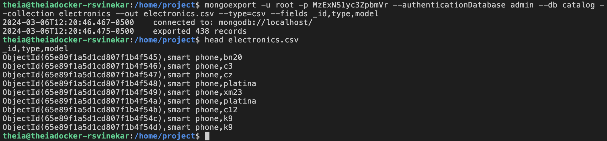

# Objectives

In this assignment, the tasks are:

-   import data into a MongoDB database.

-   query data in a MongoDB database.

-   export data from MongoDB.

# Tools / Software

-   MongoDB Server

-   MongoDB Command Line Backup Tools

## Exercise 1 - Check the lab environment

Before you proceed with the assignment :

-   Check if you have the ‘mongoimport’ and ‘mongoexport’ installed on the lab, otherwise install them.

-   Download the catalog.json file.

## Exercise 2 - Working with MongoDB

### Task 1 - Import ‘catalog.json’ into mongodb server into a database named ‘catalog’ and a collection named ‘electronics’

mongoimport.jpg

### Task 2 - List out all the databases

list-dbs.jpg.

### Task 3 - List out all the collections in the database ‘catalog’.

list-collections.jpg

### Task 4 - Create an index on the field “type”

create-index.jpg

### Task 5 - Write a query to find the count of laptops

mongo-query-laptops.jpg

### Task 6 - Write a query to find the number of ‘smart phones’ with screen size of 6 inches.

mongo-query-mobiles1.jpg

### Task 7. Write a query to find out the average screen size of ‘smart phones’ .

mongo-query-mobiles2.jpg.

### Task 8 - Export the fields \_id, “type”, “model”, from the ‘electronics’ collection into a file named ‘electronics.csv’

****

mongoexport.jpg
