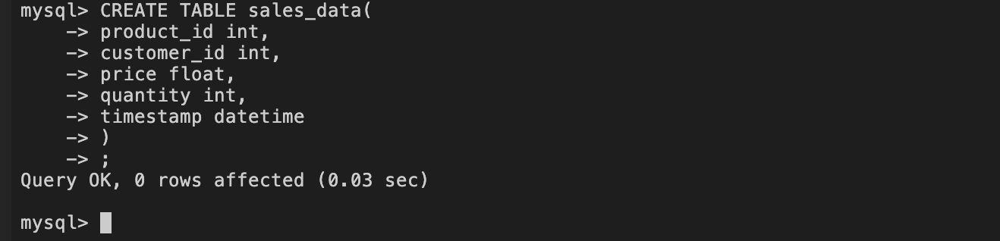
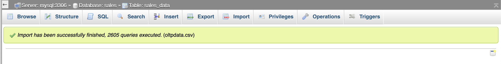
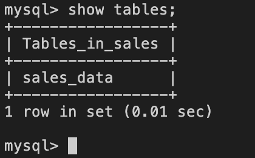
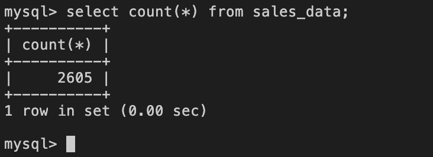
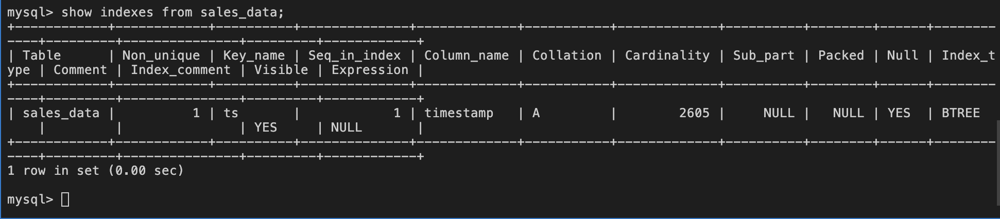
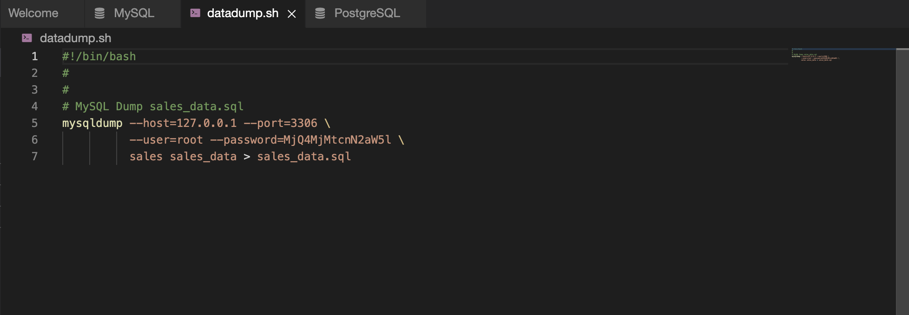

# OLTP database requirements and design


## OLTP database
OLTP database is generally used to handle every day business transactions of an organization like a bank or a super market chain. OLTP databases can be write heavy or may have a balanced read/write load.

## OLTP database requirements:
An OLTP database is expected to handle a huge number of transactions per second. Each transaction usually involves accessing (read/write) a small portion of the database, in other words the payload per transaction is small.

The time taken to execute a transaction usually called latency needs to be very less.

## OLTP database design:
The schema of an OLTP database is higly normalized so as to achieve a very low latency. To further improve the latency an OLTP database stores only the recent data like the last few week's data. They are usually run on storage that is very fast like SSD.

# Scenario
You are a data engineer at an e-commerce company. Your company needs you to design a data platform that uses MySQL as an OLTP database. You will be using MySQL to store the OLTP data.

## Objectives
In this assignment you will:

- design the schema for OLTP database.
- load data into OLTP database.
- automate admin tasks.

## Tools / Software
- MySQL 8.0.22
- phpMyAdmin 5.0.4

# Exercise - Design the OLTP Database
## Task 1 - Create a database.
Create a database named sales.
```
>CREATE DATABASE sales;
>USE sales;
```

## Task 2 - Design a table named sales_data.
Design a table named sales_data based on the sample data given.


Create the sales_data table in sales database.



# Exercise - Load the Data

## Task 3 - Import the data in the file oltpdata.csv
- Download the file [oltpdata.csv](oltpdata.csv) from https://cf-courses-data.s3.us.cloud-object-storage.appdomain.cloud/IBM-DB0321EN-SkillsNetwork/oltp/oltpdata.csv

- Import the data from oltpdata.csv into sales_data table using phpMyAdmin.

Screenshot of the phpMyAdmin import status.

importdata.png


## Task 4 - List the tables in the database sales.


listtables.png

## Task 5. Write a query to find out the count of records in the tables sales_data.


salesrows.png

# Exercise - Set up Admin tasks
## Task 6 - Create an index
Create an index named ts on the timestamp field.

Task 7 - List indexes
List indexes on the table sales_data.


Task 8 - Write a bash script to export data.
Write a bash script named datadump.sh that exports all the rows in the sales_data table to a file named sales_data.sql

