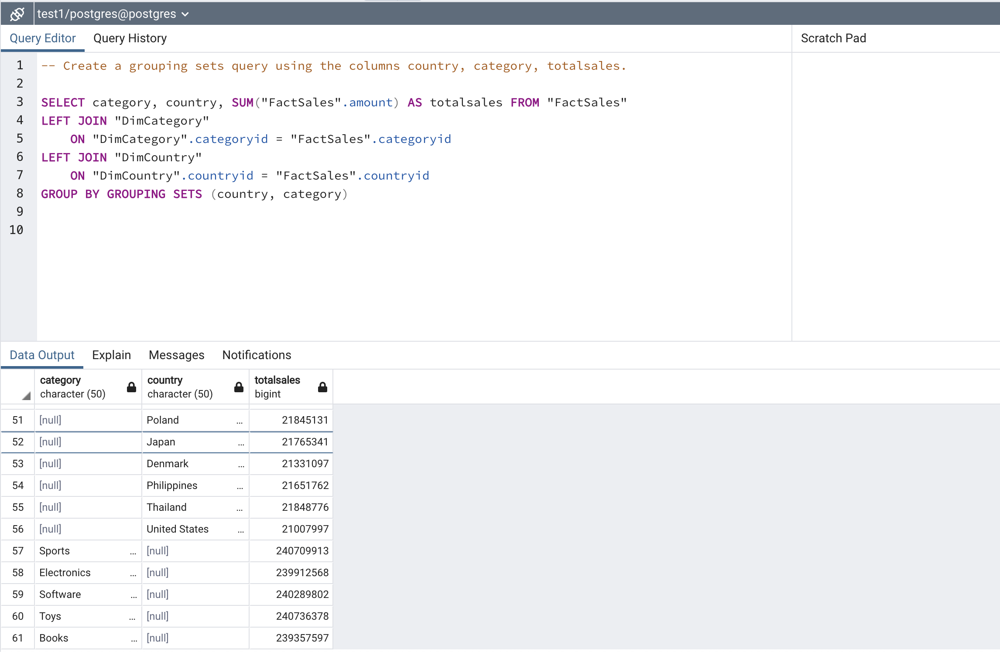
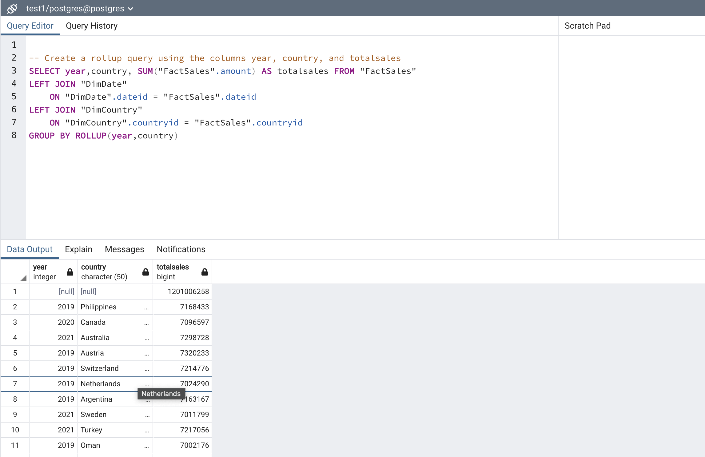
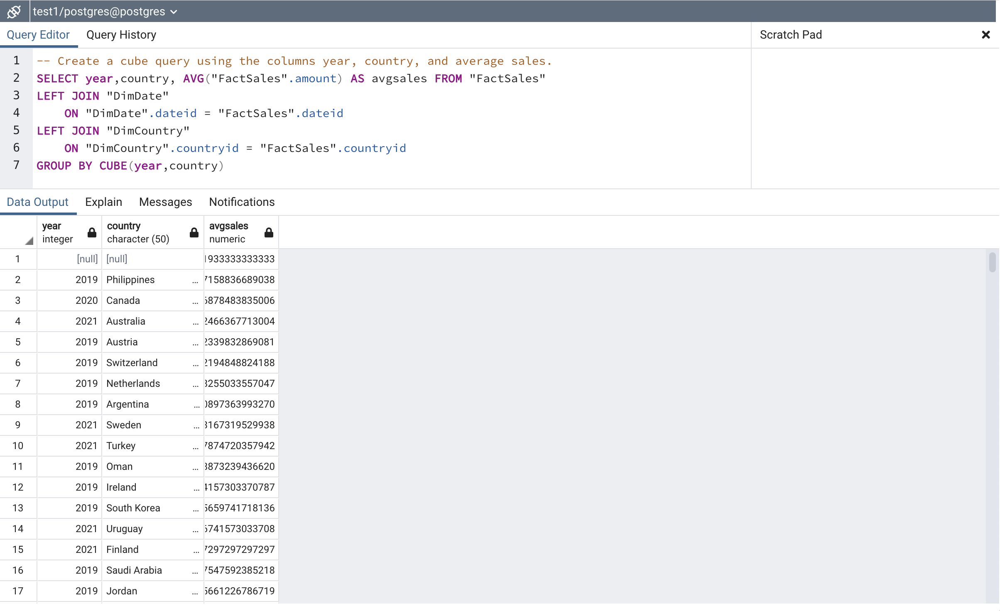
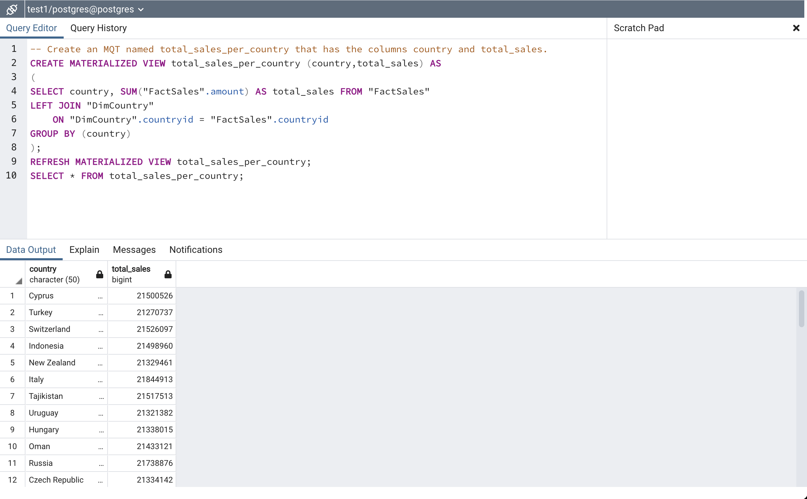

# Scenario
You are a data engineer hired by an ecommerce company named SoftCart.com . The company retails download only items like E-Books, Movies, Songs etc. The company has international presence and customers from all over the world. You have designed the schema for the data warehouse in the previous assignment. Data engineering is a team game. Your senior data engineer reviewed your design. Your schema design was improvised to suit the production needs of the company. In this assignment you will generate reports out of the data in the data warehouse.

# Objectives
In this assignment you will:

- Load data into Data Warehouse
- Write aggregation queries
- Create MQTs

# About the dataset
The dataset you would be using in this assignment is not a real life dataset. It was programmatically created for this assignment purpose.
This exercise is implemented in PostgreSQL. It can also be implemented in IBM DB2. The MQT or Materialised queries work slightly different from PostgreSQL and the language is slightly different but the principles are the same.
 

# Prepare the lab environment
Before you start the assignment:

1. Right Click on this link and save this SQL file in you local system.

2. Start PostgreSQL server

3. Create a new database Test1

4. Create the following tables

	- DimDate
	- DimCategory
	- DimCountry
	- FactSales

# Loading Data
In this exercise you will load the data into the tables. You will load the data provided by the company in csv format.

## Task 1 - Load data into the dimension table DimDate
# Download the data from this link [DimDate.csv](DimDate.csv)

# Load the downloaded data into DimDate table.

Take a screenshot of the first 5 rows in the table DimDate.


## Task 2 - Load data into the dimension table DimCategory
Download the data from this link [DimCategory.csv](DimCategory.csv)
Load the downloaded data into DimCategory table.

Take a screenshot of the first 5 rows in the table DimCategory.


## Task 3 - Load data into the dimension table DimCountry
Download the data from this link [DimCountry.csv](DimCountry.csv)

Load the downloaded data into DimCountry table.

Take a screenshot of the first 5 rows in the table DimCountry.

Name the screenshot DimCountry.jpg. (Images can be saved with either the .jpg or .png extension.)

## Task 4 - Load data into the fact table FactSales
Download the data from this link [FactSales.csv](FactSales.csv)

Load this data into FactSales table.

Take a screenshot of the first 5 rows in the table FactSales.


# Queries for data analytics
In this exercise you will query the data you have loaded in the previous exercise.

## Task 5 - Create a grouping sets query
Create a grouping sets query using the columns country, category, totalsales.

Take a screenshot of the sql and the output rows.


## Task 6 - Create a rollup query
Create a rollup query using the columns year, country, and totalsales.

Take a screenshot of the sql and the output rows.


## Task 7 - Create a cube query
Create a cube query using the columns year, country, and average sales.

Take a screenshot of the sql and the output rows.


## Task 8 - Create an MQT - Materialized Query Table
Create an MQT named total_sales_per_country that has the columns country and total_sales.

Take a screenshot of the sql.

Name the screenshot mqt.jpg. (Images can be saved with either the .jpg or .png extension.)

In IBM DB2, there is a difference in the syntax:
instead of PosgreSQL
```
	CREATE MATERIALIZED VIEW ...(...) AS (
	...
	);
	REFRESH MATERIALIZED VIEW ...;
```
IBM DB2 uses 
```
	CREATE TABLE ...(...) AS (
	...
	)
    DATA INITIALLY DEFERRED
    REFRESH DEFERRED
    MAINTAINED BY SYSTEM;
```
