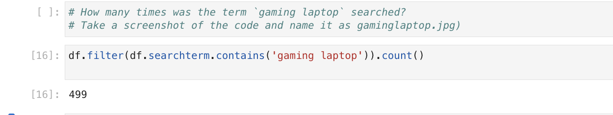

# Apache Spark

---

# Scenario
Analyse a big data dataframe by loading a Linear Regression model

# Objectives
In this assignment you will download the search term data set for the e-commerce web server and run analytic queries on it.
- Create Spark Session
- Load data into Spark dataframe
- Run Queries and analysis on dataframe
- Load and utilise a Linear Regression Model


## Tools / Software
- Jupyter Notebook
- Apache Spark
- Python and PySpark
- wget : external linux command to download data

The analysis is available in the [Spark_MLOps.ipynb](Spark_MLOps.ipynb) Jupyter notebook. This md file documents the screenshots

# Exercise 1

## Task1: Load the csv into a spark dataframe
```
df = spark.read.csv("searchterms.csv",header=True, inferSchema=True)
```
## Task2:  Print the number of rows and columns

Take a screenshot of the code and name it as shape.jpg)

## Task3:  Print the top 5 rows


Take a screenshot of the code and name it as top5rows.jpg)

## Task4: Find out the datatype of the column searchterm?

Take a screenshot of the code and name it as datatype.jpg

## Task5: How many times was the term `gaming laptop` searched?

Take a screenshot of the code and name it as gaminglaptop.jpg)

## Task6: Print the top 5 most frequently used search terms?

Take a screenshot of the code and name it as top5terms.jpg)

## Task7: Load the sales forecast model.

Take a screenshot of the code and name it as loadmodel.jpg)

## Task8: Using the sales forecast model, predict the sales for the year of 2023.

Take a screenshot of the code and name it as forecast.jpg

|  PREV : [Business Intelligence Dashboard - IBM Cognos Analytics](Cognos.md) | NEXT : Thanks for your attention!!
|---|---|